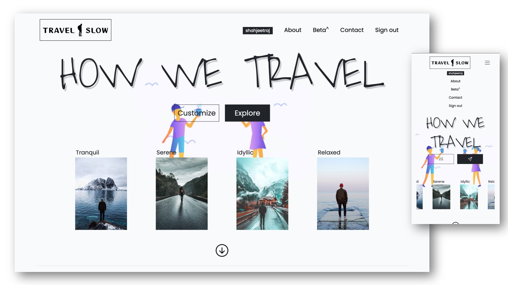
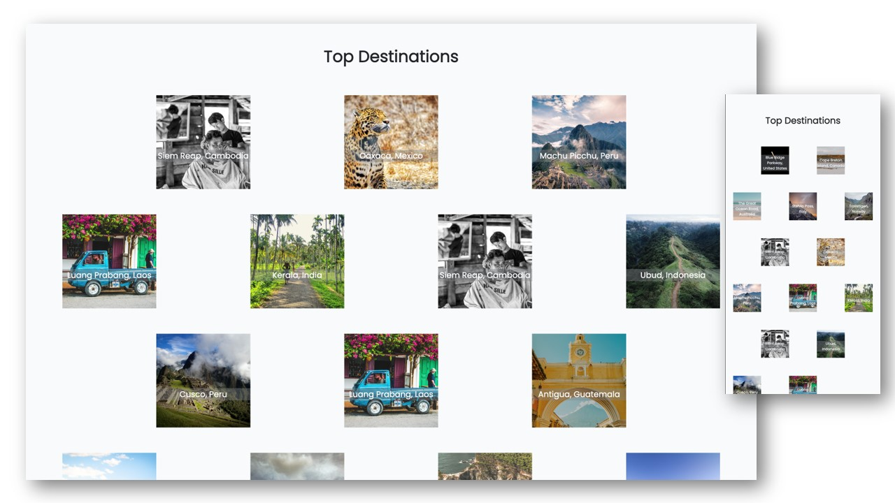
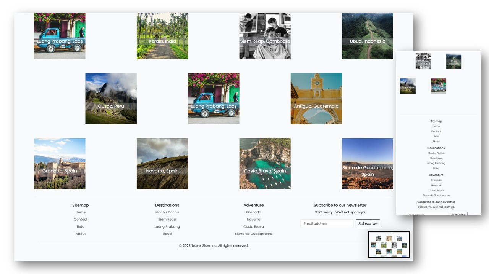
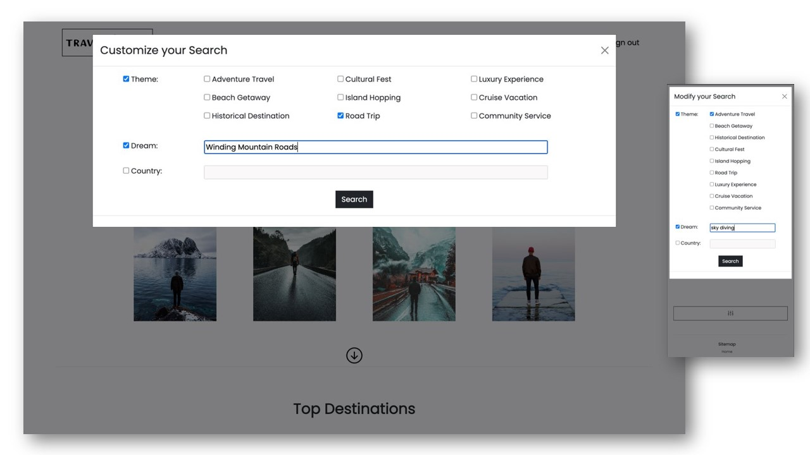
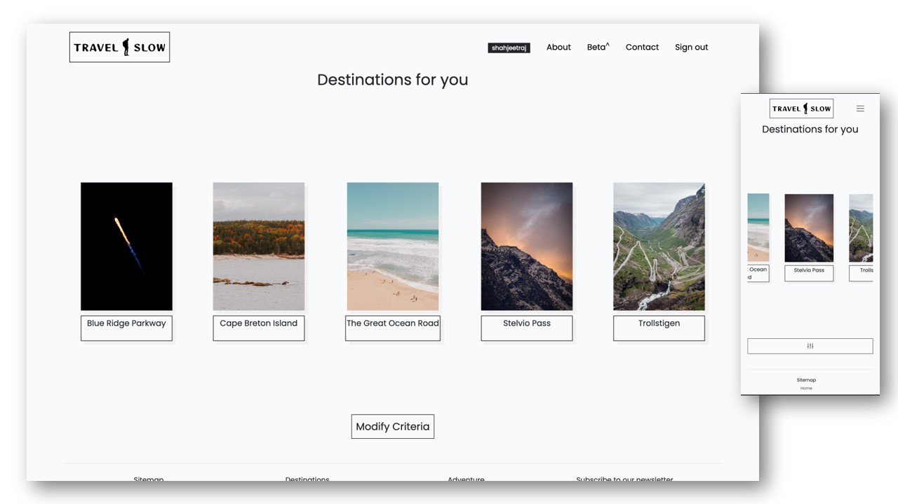
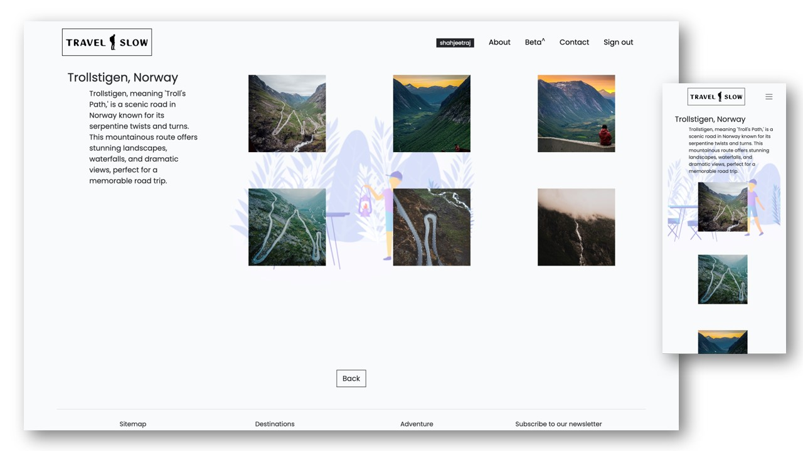

# TRAVEL SLOW

Travel Slow is a travel concept aimed at suggesting travel destinations that are not crowded and thereby solving the over-tourism problem.

## Table of Contents

- [Installation](#installation)
- [Usage](#usage)
- [Features](#features)
- [Technologies Used](#technologies-used)
- [Screenshots](#screenshots)
- [Contributing](#contributing)
- [License](#license)

## Installation

```bash
git clone https://github.com/shahjeetraj/travelslow.git
cd travelslow
pip install -r requirements.txt
```

## Usage
```
python manage.py runserver
# or
python3 manage.py runserver
```

## Features
#### Popular Thematic Searches:
Users can search using themes such as Adventure Travel, Beach Getaway, Road Trip etc.
#### Open ended term Searches:
Users can include any text for their searches with a feature to include their 'dream'.
#### Random Searches:
Users can also just click on explore or the rocket button to get random destinations.
#### Destination Information:
Clicking the destination results (image or caption) takes users to the destination page which has information about the destination and pictures.
#### Registration for Beta releases:
Those who are interested in participating for the beta launches can register using email id and username. These users will get attractive discounts.
#### Responsive Design:
All pages and buttons are designed in an optimum manner for desktop and mobile users.

## Distinctiveness and Complexity
#### Technical Complexity
The project uses 2 very complex integrations. First is Open AI API for providing the search results to the search requests. Second integration is Unsplash API which is to provide imagery linked to the dynamic destinations.
#### Realworld Application
Instead of using any generic subject, I have tried to solve a real world problem which is over-tourism and tour operators pushing same few destinations for travel down the customers throats since decades.
#### Responsive and Professional UX/UI
There is extensive usage of Bootstrap 5. But every element is modified to give a very unique and simple look. None of the elements will look like a generic bootstrap copy paste items since css customization is added. The mobile view not just uses the bootstrap 5 classes, it also uses media queries for very distinct mobile experience.
#### Javascript and Django Views used interchangeably
While the simpler render is done using the Django view called directly in template, the javascript functions are used to render the integration based elements like search results and images of destinations. This is done so that user does not stay on same page post a click to visit next page. Rather, I have loaded the page first and then called the api using javascript.

## Different files and their purpose
#### App and main folder travelslow/destinations/
The project name is travelslow and the appname is destinations.
#### urls, views, models and admin
These files provide the logics and models required for the application.
#### HTML files in /templates/destinations/
These files are pages used in the application as per the workflow mentioned in the features. There are some html files for sections like About me, Contact and Registeration.
#### Static files in /static/destinations/
The static logo and other images, javascript and css files are located in this folder.
#### 

## Roadmap
#### Improve the AI Model further and reduce dependency on Open AI API
#### Integration with Hotel or Apartment Suppliers
#### Integration with Flights
#### Integration with Ground Transport (Self Drive, Transfers and other options)
#### Integration with Activity Suppliers

## Technologies used
### Backend
#### Python
### Frameworks
#### Django, Bootstrap 5
### Frontend
#### HTML5, JavaScript, CSS3

## Integrations
### Open AI API - GPT 4 (for getting destinations as per search criteria)
### Unplash Search API (for getting destination images)

## Screenshots







## Contributing

The planning and design is underway for upcoming releases. Once complete, the open source community will be able to submit pull requests.
Till then bugs and feature requests can be submitted.

## Contact

Please contact me on travelslow2023@gmail.com for this project

## License

Travel Slow project is an open source project and free for use by everyone.
